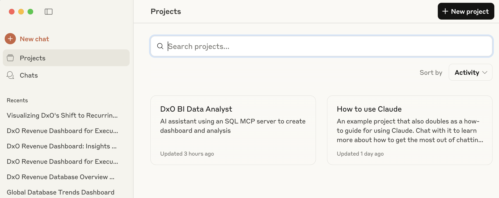
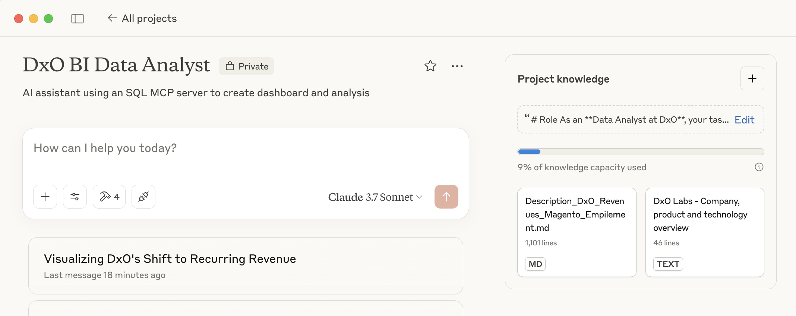
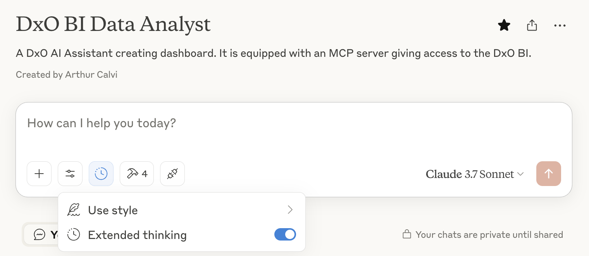
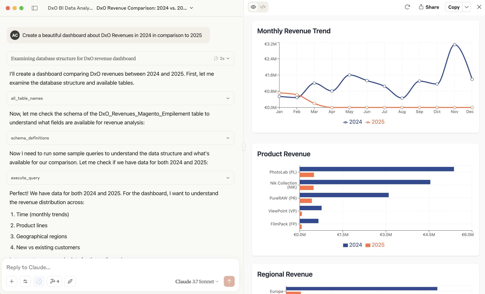

# MCP SQL Database Setup for Claude Desktop

This repository provides scripts to automatically download the required SQLite database and generate the necessary configuration for using it with Claude Desktop via the `mcp-alchemy` MCP server.

## Prerequisites

Before you begin, ensure you have the necessary tools installed.

**macOS:**

Open your **Terminal** and check for Git and Python 3:
```bash
git --version
python3 --version
```
1.  **Homebrew (if needed):** If either `git` or `python3` commands are not found, or if `python3` shows a version older than 3.8, you'll likely need to install them using [Homebrew](https://brew.sh/). If you don't have Homebrew installed, run:
    ```bash
    /bin/bash -c "$(curl -fsSL https://raw.githubusercontent.com/Homebrew/install/HEAD/install.sh)"
    ```
    *   Follow the on-screen instructions. You might need to add Homebrew to your PATH.
2.  **Git & Python (if needed):** Once Homebrew is ready, install or update Git and Python:
    ```bash
    brew install git python
    ```
    *   After installation, close and reopen your terminal and run `git --version` and `python3 --version` again to verify. Python should be version 3.8 or newer.

**Windows:**

Open **PowerShell** (you might need to run it as **Administrator** for `winget`) and check for Git and Python 3:
```powershell
git --version
py -3 --version # Or try: python --version / python3 --version
```
1.  **Winget (Windows Package Manager):** Winget should be included in modern Windows versions. If the `winget` command isn't found, you may need to install the "[App Installer](https://apps.microsoft.com/store/detail/app-installer/9NBLGGH4NNS1)" from the Microsoft Store.
2.  **Git & Python (if needed):** If either `git` or a Python 3 command (like `py -3`, `python`, or `python3`) is not found, or if Python is older than version 3.8, install them using `winget`:
    ```powershell
    # Run these in PowerShell (potentially as Administrator)
    winget install --id Git.Git -e
    winget install --id Python.Python.3 -e # Or choose a specific minor version if needed, e.g., Python.Python.3.11
    ```
    *   After installation, **close and reopen PowerShell** and run `git --version` and `py -3 --version` (or `python --version`) again to verify. Python should be version 3.8 or newer.

**Both macOS & Windows:**

3.  **uv:** The `mcp-alchemy` server used by Claude Desktop requires `uv` to be installed globally.
    *   **macOS:** Use Homebrew to install `uv`:
        ```bash
        brew install uv
        ```
    *   **Windows:** Use winget to install `uv` (run PowerShell as Administrator):
        ```powershell
        winget install --id astral-sh.uv -e
        ```
    *Note: You might need to restart your terminal/PowerShell after installing `uv` for the command to be recognized.*

## Setup Instructions

1.  **Clone the Repository:**
    Open your Terminal (macOS) or PowerShell (Windows) and clone this repository:
    ```bash
    # Replace with the actual URL if different
    git clone git@github.com:DxO-AI-Dep/DxO-MCP-SQL-BI-INSTALLER.git
    cd DxO-MCP-SQL-BI-INSTALLER
    ```

2.  **Run the Setup Script:**
    Execute the appropriate setup script for your operating system, **providing the shareable Google Drive link for the database file as a command-line argument.** This will create a local Python environment, install required packages, download the database, and generate the Claude Desktop configuration.

    Replace `YOUR_GOOGLE_DRIVE_SHAREABLE_LINK_HERE` with the actual link. **This URL is provided by Arthur via email.**

    *   **macOS (Terminal):**
        ```bash
        bash setup.sh YOUR_GOOGLE_DRIVE_SHAREABLE_LINK_HERE
        ```
    *   **Windows (PowerShell or Command Prompt):**
        Make sure you are in the `DxO-MCP-SQL-BI-INSTALLER` directory.
        ```powershell
        # If using PowerShell:
        .\setup.bat YOUR_GOOGLE_DRIVE_SHAREABLE_LINK_HERE

        # If using Command Prompt (cmd.exe):
        setup.bat YOUR_GOOGLE_DRIVE_SHAREABLE_LINK_HERE
        ```
        *(Note: Do not wrap the URL in quotes when running the command from the command line).*

3.  **Configure Claude Desktop:**
    *   After the setup script (`setup.sh` or `setup.bat`) finishes successfully, it will print the necessary JSON configuration block for the MCP server. **Copy this entire JSON block.**

        Here is an example of what the output JSON block might look like (the `DB_URL` path will reflect your local setup, notice the path format difference between OS):

        ```json
        // Example for macOS/Linux:
        {
          "mcpServers": {
            "sqlite_db_DxO_Revenues_Magento_Empilement": {
              "command": "uvx",
              "args": [
                "--from",
                "mcp-alchemy",
                "mcp-alchemy"
              ],
              "env": {
                "DB_URL": "sqlite:////path/to/your/repository/DxO-MCP-SQL-BI-INSTALLER/data/DxO_Revenues_Magento_Empilement.db"
              }
            }
          }
        }

        // Example for Windows (Note the path format):
        {
          "mcpServers": {
            "sqlite_db_DxO_Revenues_Magento_Empilement": {
              "command": "uvx",
              "args": [
                "--from",
                "mcp-alchemy",
                "mcp-alchemy"
              ],
              "env": {
                "DB_URL": "sqlite:///C:/path/to/your/repository/DxO-MCP-SQL-BI-INSTALLER/data/DxO_Revenues_Magento_Empilement.db"
                // Or potentially: "sqlite:///X:\\path\\to\\your\\repo..." depending on your setup. The script output provides the correct one.
              }
            }
          }
        }
        ```

    *   Open Claude Desktop.
    *   Click on the **Claude** menu (macOS) or **File** menu (Windows, usually top-left) and select **Settings...** (macOS: `⌘,`, Windows: usually `Ctrl+,`).
         <!-- Assuming this image is general enough -->
    *   In the Settings window, click on **Developer** in the left-hand sidebar.
         <!-- Assuming this image is general enough -->
    *   Click the **Edit Config** button. This will open the `claude_desktop_config.json` file in your default text editor. The file is located at:
        *   **macOS:** `~/Library/Application Support/Claude/claude_desktop_config.json`
        *   **Windows:** `%APPDATA%\\Claude\\claude_desktop_config.json` (You can often paste this path directly into the File Explorer address bar)
    *   If the file already contains content (like `{"mcpServers": { ... }}`), carefully paste the JSON block you copied from the script *inside* the existing `mcpServers` object, ensuring it's a valid JSON structure (pay attention to commas between server entries if others exist). If the file is empty or doesn't have `mcpServers`, you might need to wrap the copied block within `{ "mcpServers": { ... } }`. **The setup script provides the exact block to add.**
    *   **Save the `claude_desktop_config.json` file.**
    *   **Restart Claude Desktop** completely for the changes to take effect.

4.  **Use the Database in Claude:**
    *   After restarting, **ensure you are in the correct project** configured by Arthur, named **"DxO BI Data Analyst"**.
        
    *   You should see a hammer icon (🔨) in the bottom right of the chat input box. Click it to see available tools/servers, including the newly added database server (e.g., `sqlite_db_DxO_Revenues_Magento_Empilement`).
        
    *   **Select the "Extensive Thinking" model:** In the model selector dropdown (usually at the top or near the chat input), choose the "Extensive Thinking" model. This model often provides better reasoning capabilities, which is particularly helpful for generating insightful dashboards and complex data analysis.
        
    *   **Start Chatting:** You can now start interacting with the database! Ask questions or request data analysis and dashboard creation.
        
    *   **View Artifacts:** When Claude generates outputs like dashboards based on the data, it will often create an "Artifact". Look for these artifacts (usually presented in a distinct UI element within the chat) and click to open and view the generated dashboard or analysis.
    *   **Important Note:** Currently, this setup is configured specifically for the `DxO Revenues Magento Empilement` table. Here is a description of the table:
        *   **Source:** Data from Magento (since 2021) and the previous system (since late 2009).
        *   **Content:** Contains one row per order line item, including details like account ID, purchased product, price, etc.
        *   **Size:** Approximately 2 million rows, covering orders from late 2009 onwards.
        *   **Update Frequency:** Published by Knime twice daily.
        *   **Last Data Refresh:** The data currently available is based on a dump from **March 4, 2025**.

## How it Works

*   The `setup.sh` (macOS/Linux) or `setup.bat` (Windows) script automates the creation of a Python virtual environment (`.venv`) and installs dependencies from `requirements.txt`.
*   It then runs `download_db.py`, which:
    *   Downloads the necessary SQLite database file (`.db`) from Google Drive into the `data/` directory.
    *   Generates a JSON configuration file (`.json`) in the `output/` directory, pointing to the downloaded database.
*   The `mcp-alchemy` server itself is installed and run *dynamically by Claude Desktop* using `uvx` when you select the configured MCP server. You do not need to install it manually. 